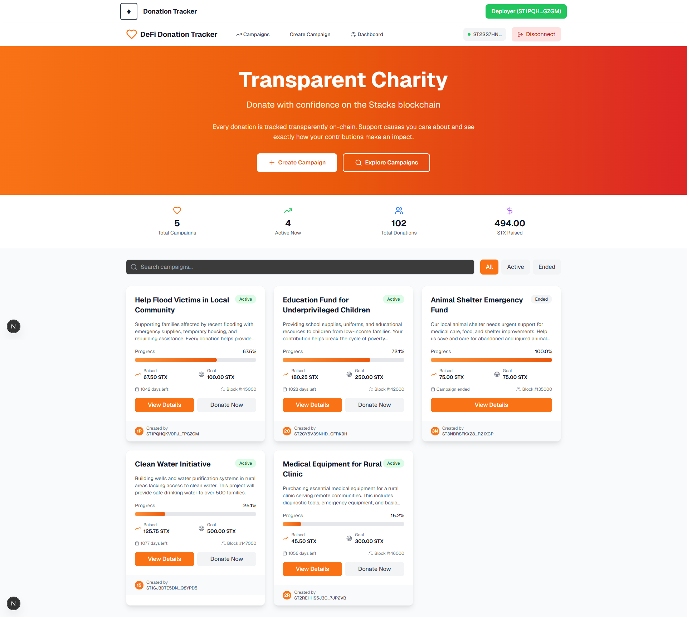
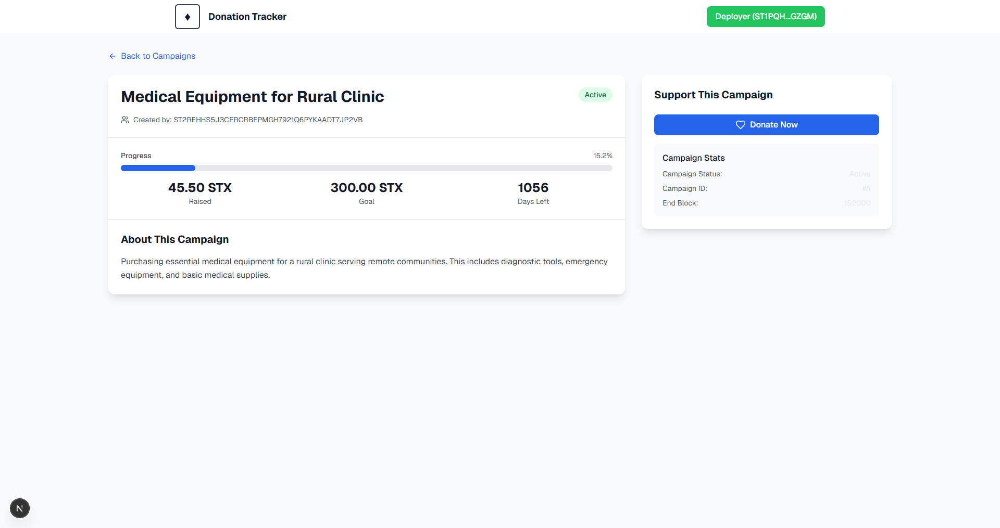
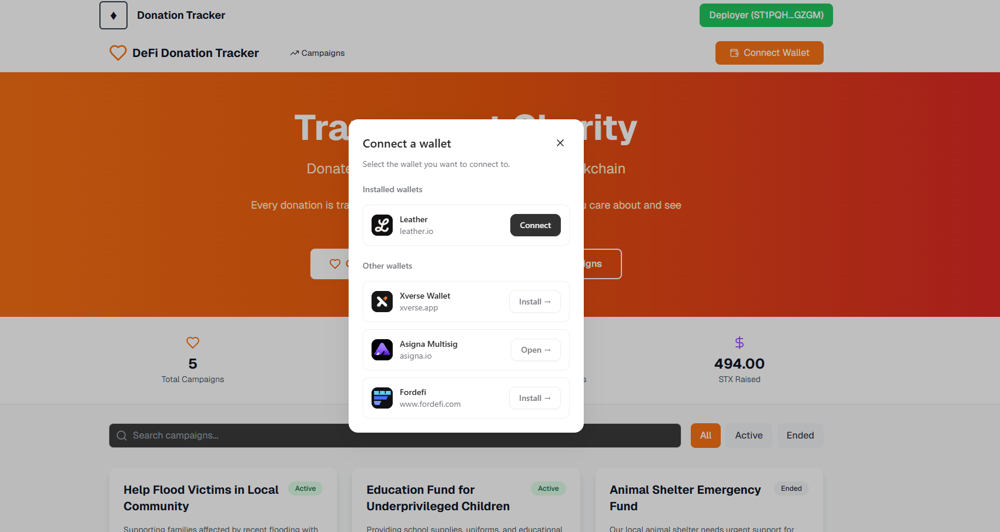
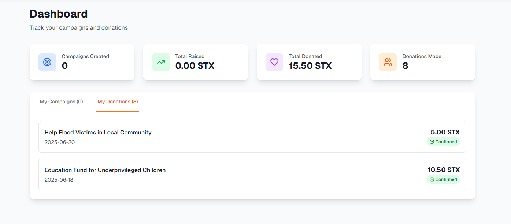
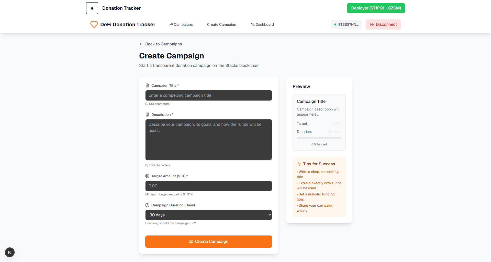
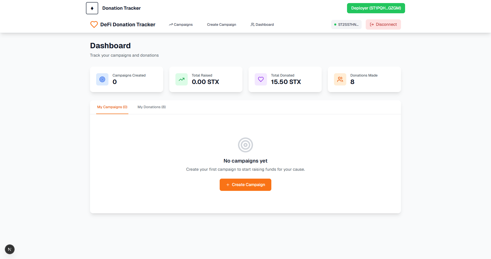
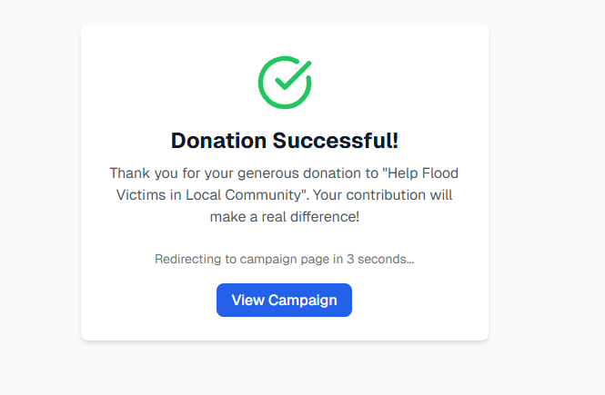
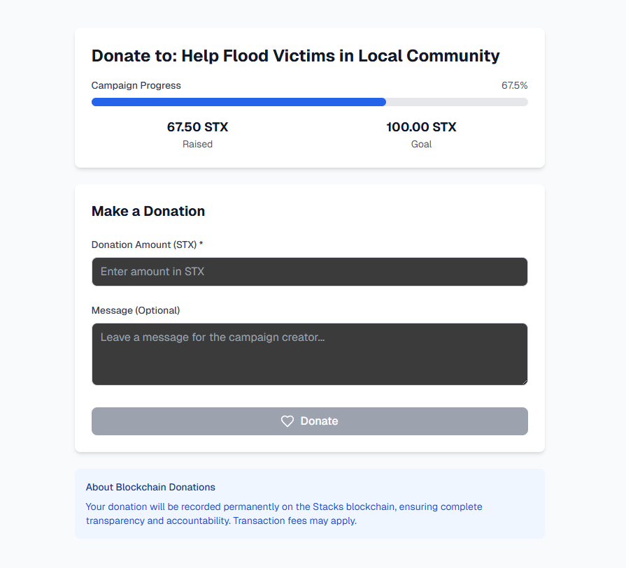

# 🎯 Stacks DeFi Donation Tracker


A decentralized application (dApp) for transparent charity donations built on the Stacks blockchain. Every donation is tracked on-chain, providing complete transparency and accountability for donors and campaign creators with Bitcoin-level security.

## 📸 Application Screenshots

### 🏠 Home Page & Campaign Listing

*Main dashboard showcasing active campaigns with real-time progress tracking, donation statistics, and campaign filtering options*

### 📋 Campaign Details & Donation Flow

*Detailed campaign view displaying progress metrics, campaign information, and donation interface*


*User-friendly donation form with STX amount input, optional message field, and blockchain transparency information*


*Success confirmation screen with transaction details and automatic redirect to campaign page*

### ⚙️ Campaign Management

*Comprehensive campaign creation interface with form validation, live preview, and success tips*

### 📊 User Dashboard

*Personal dashboard for tracking created campaigns, donation history, and reward points with detailed statistics*


*Detailed view of user's donation history with transaction confirmations and contribution tracking*

### 💼 Wallet Integration

*Multi-wallet support interface with seamless integration for Hiro Wallet, Xverse, and other Stacks-compatible wallets*

## 🌟 Features

### ✨ Core Functionality
- **Transparent Donations**: All donations recorded immutably on the Stacks blockchain
- **Campaign Management**: Create and manage donation campaigns with goals and deadlines
- **Real-time Tracking**: Monitor donation progress and campaign statistics
- **Donor Recognition**: Points-based reward system for contributors
- **Multi-wallet Support**: Compatible with Hiro Wallet and Xverse
- **Bitcoin Security**: Leverages Bitcoin's security through Stacks blockchain

### 🎯 Campaign Features
- Set funding targets and campaign duration
- View detailed campaign statistics and progress
- Campaign creator fund withdrawal system
- Emergency pause functionality for campaign creators
- Transparent fund tracking with blockchain verification

### 🏆 Rewards System
- Earn donation points for every contribution (1 STX = 100 points)
- Tiered donor levels (Bronze, Silver, Gold, Platinum, Diamond)
- Milestone rewards and achievements
- Community leaderboard and donor recognition

## 🛠 Technology Stack

- **Blockchain**: Stacks blockchain with Bitcoin security
- **Smart Contracts**: Clarity programming language
- **Frontend**: Next.js 15 with App Router and TypeScript
- **Styling**: Tailwind CSS for responsive design
- **Wallet Integration**: Stacks.js (@stacks/connect, @stacks/transactions)
- **State Management**: React Context API with hooks
- **Icons**: Lucide React
- **Development**: Clarinet CLI for contract development and testing
- **Deployment**: Vercel for frontend, Clarinet for contracts

## 🚀 Quick Start

### Prerequisites
- Node.js 18+ and npm
- Stacks wallet (Hiro Wallet or Xverse browser extension)
- STX tokens for testnet interactions

### Installation

1. **Clone the repository**
   ```bash
   git clone https://github.com/yourusername/stacks-donation-tracker.git
   cd stacks-donation-tracker
   ```

2. **Install dependencies**
   ```bash
   npm install
   ```

3. **Set up environment variables**
   ```bash
   cp .env.example .env.local
   ```
   
   Update the values in `.env.local`:
   ```env
   NEXT_PUBLIC_NETWORK=testnet
   NEXT_PUBLIC_CONTRACT_ADDRESS=ST1PQHQKV0RJXZFY1DGX8MNSNYVE3VGZJSRTPGZGM
   NEXT_PUBLIC_DONATION_TRACKER_CONTRACT=donation-tracker
   NEXT_PUBLIC_DONATION_REWARDS_CONTRACT=donation-rewards
   NEXT_PUBLIC_STACKS_API_URL=https://stacks-node-api.testnet.stacks.co
   NEXT_PUBLIC_EXPLORER_URL=https://explorer.stacks.co
   ```

4. **Run the development server**
   ```bash
   npm run dev
   ```

5. **Open your browser**
   Navigate to [http://localhost:3000](http://localhost:3000)

## 📄 Smart Contracts

### 🎯 Donation Tracker Contract (`donation-tracker.clar`)

The main contract handles all donation campaign logic:

#### Public Functions
- `create-campaign(title, description, target, duration)` - Create a new donation campaign
- `donate(campaign-id, amount)` - Make a donation to a campaign
- `withdraw-funds(campaign-id)` - Withdraw funds (campaign creator only)
- `pause-campaign(campaign-id)` - Emergency pause a campaign
- `resume-campaign(campaign-id)` - Resume a paused campaign

#### Read-Only Functions
- `get-campaign(campaign-id)` - Retrieve campaign details
- `get-campaign-stats(campaign-id)` - Get campaign statistics
- `get-total-campaigns()` - Total number of campaigns
- `get-user-campaigns(user)` - Get campaigns created by a user
- `get-user-donations(user)` - Get donations made by a user
- `is-campaign-active(campaign-id)` - Check if a campaign is active

### 🏆 Donation Rewards Contract (`donation-rewards.clar`)

Manages the points system and donor rewards:

#### Features
- SIP-010 compliant fungible token for donation points
- Automatic point allocation (1 STX = 100 points)
- Milestone reward system with 5 donor tiers
- Donor level classification based on total donations
- Reward claiming mechanism with transparent tracking

#### Public Functions
- `award-points(recipient, amount)` - Award points for donations
- `claim-milestone-reward(milestone)` - Claim milestone rewards
- `get-donor-level(user)` - Get donor tier level
- `get-user-points(user)` - Get user's total points
- `get-milestone-reward(milestone)` - Get milestone reward amount

## 🔧 Development Workflow

### Smart Contract Development

1. **Install Clarinet**
   ```bash
   # Install Rust first
   curl --proto '=https' --tlsv1.2 -sSf https://sh.rustup.rs | sh
   source ~/.cargo/env
   
   # Install Clarinet
   cargo install clarinet-cli
   ```

2. **Verify contracts**
   ```bash
   npm run contracts:check
   ```

3. **Run tests**
   ```bash
   npm run contracts:test
   ```

4. **Start local blockchain**
   ```bash
   npm run contracts:integrate
   ```

### Frontend Development

1. **Start development server**
   ```bash
   npm run dev
   ```

2. **Run tests**
   ```bash
   npm run test
   ```

3. **Build for production**
   ```bash
   npm run build
   ```

4. **Run with contracts (full stack)**
   ```bash
   npm run dev:full
   ```

## 🚀 Deployment

### Smart Contract Deployment

1. **Deploy to testnet**
   ```bash
   npm run deploy:testnet:plan    # Generate deployment plan
   npm run deploy:testnet:apply   # Execute deployment
   ```

2. **Deploy to mainnet**
   ```bash
   npm run deploy:mainnet:plan    # Generate deployment plan
   npm run deploy:mainnet:apply   # Execute deployment
   ```

### Frontend Deployment

1. **Deploy to Vercel**
   ```bash
   # Install Vercel CLI
   npm i -g vercel
   
   # Deploy
   vercel --prod
   ```

2. **Update environment variables**
   - Add environment variables in Vercel dashboard
   - Update contract addresses after deployment

## 📱 Usage Guide

### For Donors

1. **Connect Wallet**
   - Click "Connect Wallet" button
   - Choose Hiro Wallet or Xverse
   - Approve connection in wallet extension

2. **Browse Campaigns**
   - View active campaigns on homepage
   - Use search and filters to find specific causes
   - Click on campaigns to view detailed information

3. **Make Donations**
   - Click "Donate Now" on campaign page
   - Enter donation amount in STX
   - Confirm transaction in wallet
   - Receive donation points automatically

4. **Track Impact**
   - View your donation history in profile
   - Monitor earned reward points
   - Check donor level progression

5. **Claim Rewards**
   - Visit rewards page when eligible
   - Claim milestone rewards for donation thresholds
   - Earn recognition badges and titles

### For Campaign Creators

1. **Create Campaign**
   - Connect wallet and click "Create Campaign"
   - Fill in campaign details:
     - Title and description
     - Target amount in STX
     - Campaign duration in blocks
   - Submit transaction to deploy campaign

2. **Manage Campaign**
   - Monitor donation progress on dashboard
   - View donor list and donation amounts
   - Pause/resume campaign if needed

3. **Withdraw Funds**
   - Access campaign management page
   - Click "Withdraw Funds" when goal is met or campaign ends
   - Confirm withdrawal transaction in wallet

## 🔒 Security Features

- **Immutable Records**: All transactions recorded on Stacks blockchain
- **Smart Contract Security**: Clarity language provides safety guarantees
- **Access Control**: Only campaign creators can withdraw their funds
- **Emergency Controls**: Pause functionality for campaign management
- **Transparent Tracking**: All funds traceable through blockchain explorer
- **Bitcoin Security**: Leverages Bitcoin's Proof of Work consensus

## 🧪 Testing

### Smart Contract Tests
```bash
# Run all contract tests
npm run contracts:test

# Check contract syntax and analysis
npm run contracts:check

# Start interactive console
npm run contracts:console
```

### Frontend Tests
```bash
# Run component tests
npm run test

# Run tests in watch mode
npm run test:watch

# Run all tests (contracts + frontend)
npm run test:all
```

## 🏗️ Project Structure

```
stacks-donation-tracker/
├── contracts/                 # Smart contracts
│   ├── donation-tracker.clar
│   └── donation-rewards.clar
├── tests/                     # Contract tests
│   ├── donation-tracker_test.ts
│   └── donation-rewards_test.ts
├── src/                       # Frontend source
│   ├── app/                   # Next.js App Router
│   ├── components/            # React components
│   ├── hooks/                 # Custom React hooks
│   ├── lib/                   # Utility functions
│   └── types/                 # TypeScript types
├── scripts/                   # Deployment scripts
├── settings/                  # Clarinet deployment settings
├── Clarinet.toml             # Clarinet configuration
├── .env.example              # Environment template
└── package.json              # Dependencies and scripts
```

## 🤝 Contributing

We welcome contributions! Please follow these steps:

1. **Fork the repository**
2. **Create a feature branch**
   ```bash
   git checkout -b feature/amazing-feature
   ```
3. **Make your changes**
   - Follow TypeScript and Clarity best practices
   - Add tests for new functionality
   - Update documentation as needed
4. **Test your changes**
   ```bash
   npm run test:all
   ```
5. **Commit and push**
   ```bash
   git commit -m 'Add amazing feature'
   git push origin feature/amazing-feature
   ```
6. **Open a Pull Request**

### Development Guidelines
- Use TypeScript for type safety
- Follow React best practices and hooks patterns
- Write comprehensive tests for smart contracts
- Ensure responsive design for all screen sizes
- Add proper error handling and loading states

## 📚 Resources

- **Stacks Documentation**: https://docs.stacks.co/
- **Clarity Language Reference**: https://docs.stacks.co/clarity/
- **Clarinet Documentation**: https://github.com/hirosystems/clarinet
- **Stacks.js Documentation**: https://stacks.js.org/
- **Next.js Documentation**: https://nextjs.org/docs

## 📄 License

This project is licensed under the MIT License - see the [LICENSE](LICENSE) file for details.

## 🙏 Acknowledgments

- **Stacks Foundation** for the innovative blockchain infrastructure
- **Hiro Systems** for excellent development tools and wallet
- **Next.js Team** for the powerful React framework
- **Tailwind CSS** for the utility-first styling approach
- **Lucide** for the beautiful and consistent icon set

---

**Built with ❤️ on the Stacks blockchain for transparent and trustworthy charitable giving.**

*For detailed deployment instructions, see [DEPLOYMENT.md](DEPLOYMENT.md)*
